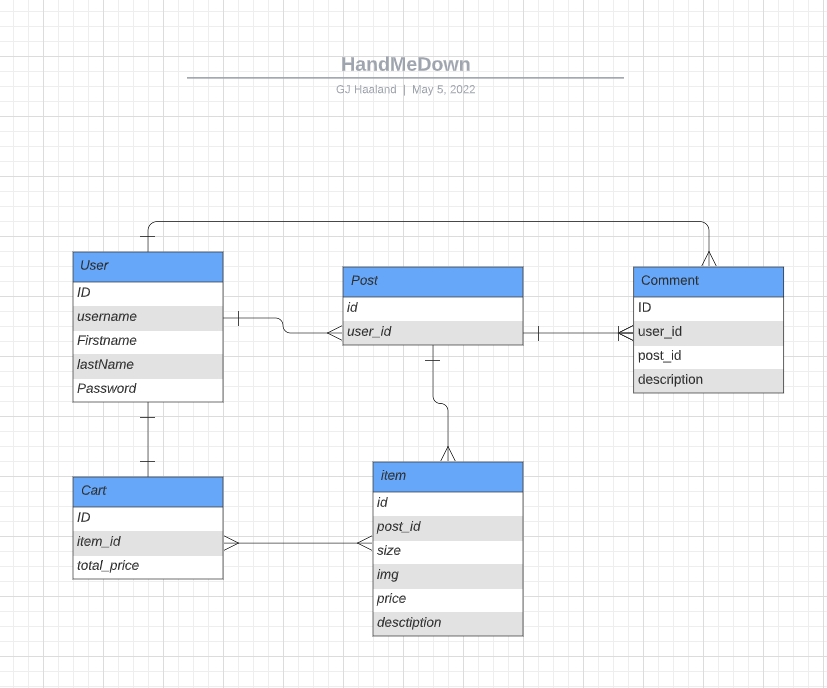

# **HandMeDown**

#### Capstone Project

---

#### GJ Haaland| [GITHUB](https://github.com/GG-Haaland) | [LINKEDIN](https://www.linkedin.com/in/gj-haaland-b3b131b7/)

## Technologies Used:

### Github, Trello, VS Code, Vue, Django

---

## **_Summary_**

For my capstone project, I decided to create a place where you could not only buy but also sell or give away your children's clothing or equipment that they grew out of. Instead of buying new clothes when your kid grows out of them... buy a used set. Save some money and save the environment. Similar looking to Etsy users will have the ability to post an item they wither want to sell or give away. They will have the ability to edit the update and delete the post as well.

## **_Front End_**

I will build a fully functional Vue app with a landing page where you will be able to sign in or sign up (with full auth hopefully) if you are not already registered. Once past the log-in page you'll see your main feed where all posts will be visible. There will be a Navigation Bar with links to Feed, Your Profile, and Sign Out. There will also be a categories filter where you can filter the post by category.

## **_Back End_**

For my database i will use Django and it will consist of posts, comments, and users. You will have the ability to add a new user by registering and logging in with full CRUD on all three models.

---

## **_Resources_**

### - [Trello](https://trello.com/b/ItY6vv9L/handmedown)

### - [Github](https://github.com/GG-Haaland/Frontend)

